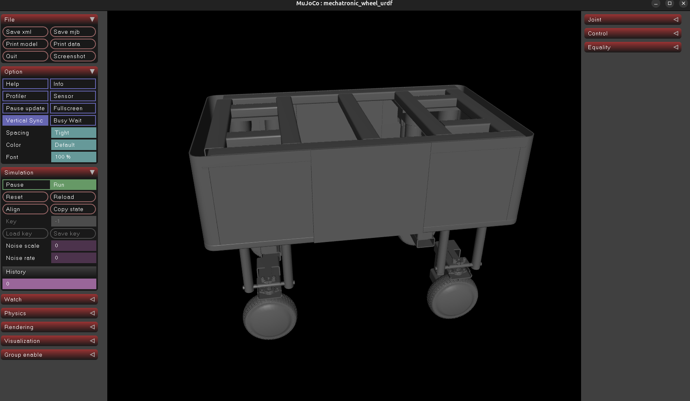
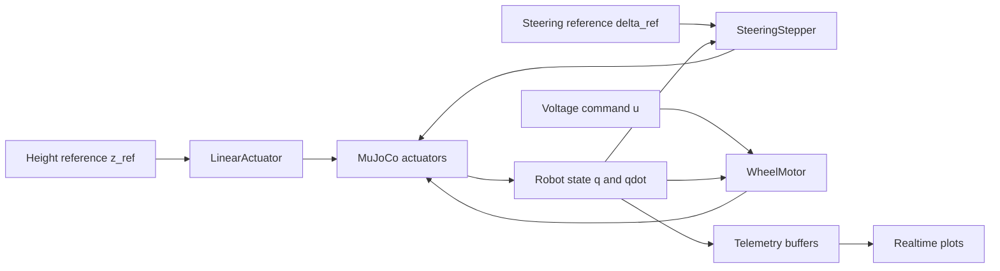

<div align="center">

# Adaptive Wheel Base

<p>
  <strong>Electromechanical MuJoCo simulation of a 4-module adaptive robotic platform</strong>
</p>

<p>
  Four independent wheel modules, three DoF per module, explicit steering control, and a DC motor traction model with live telemetry.
</p>

<p>
  <a href="https://github.com/Dcatik/adaptive-wheel-base/tree/feature/electromechanical-control">
    
  </a>
  <a href="https://docs.python.org/3/library/venv.html">
    
  </a>
  <a href="https://mujoco.readthedocs.io/en/stable/overview.html">
    
  </a>
  <a href="mujoco/mjcf/robot.xml">
    
  </a>
  <a href="LICENSE">
    
  </a>
</p>

<p>
  <a href="test.mp4">
    
  </a>
</p>

<p>
  <em>Click the render to open the simulation demo video.</em>
</p>

<p>
  <a href="#quick-start">Quick Start</a> |
  <a href="#architecture-at-a-glance">Architecture</a> |
  <a href="#controller-models">Control Models</a> |
  <a href="#simulation-entry-points">Run Scripts</a> |
  <a href="#references">References</a>
</p>

</div>

---

## Why This Repo Is Interesting

| Module | Purpose | Why It Matters |
|:--|:--|:--|
| Lift | Vertical body support and leveling | Makes asymmetric load and ride-height experiments possible |
| Steering | Per-wheel heading control | Exposes backlash, saturation, and convergence behavior |
| Wheel drive | Electromechanical traction model | Connects voltage, current, angular speed, and output torque |
| Telemetry | Real-time signal buffering and plotting | Lets you observe the control loop instead of treating the sim as a black box |

<p align="center">
  <strong>4 modules</strong> |
  <strong>12 controlled joints</strong> |
  <strong>MuJoCo + MJCF</strong> |
  <strong>Python controllers</strong>
</p>

---

## Architecture At A Glance



The repository is organized around one central idea: keep the MuJoCo model clean, and express actuator behavior explicitly in Python so the control assumptions are easy to inspect and iterate on.

---

## Repository Guide

| Path | Role |
|:--|:--|
| [`control/`](control) | Low-level actuator and motor models for lift, steering, and wheel drive |
| [`sim/`](sim) | Standalone simulation entry points and telemetry utilities |
| [`mujoco/mjcf/robot.xml`](mujoco/mjcf/robot.xml) | Main MJCF model used by the scripts |
| [`robot_description/`](robot_description) | Robot assets, meshes, and URDF-related files |
| [`requirements.txt`](requirements.txt) | Minimal Python dependency list |

<details>
<summary><strong>Full project tree</strong></summary>

```text
adaptive-wheel-base/
|-- control/
|   |-- linear_actuator.py
|   |-- steering_stepper.py
|   `-- wheel_motor.py
|-- mujoco/
|   |-- mjcf/
|   |   `-- robot.xml
|   `-- result.png
|-- robot_description/
|-- sim/
|   |-- manual_drive_test.py
|   |-- run_lift_actuators.py
|   |-- run_steering_motors.py
|   |-- run_wheel_motors.py
|   `-- telemetry.py
|-- requirements.txt
|-- LICENSE
`-- README.md
```

</details>

---

## Quick Start

Create a virtual environment and install the required packages:

```bash
python3 -m venv .venv
source .venv/bin/activate
pip install -r requirements.txt
```

Dependencies are intentionally small:

- `mujoco`
- `matplotlib`

The main simulation model lives at [`mujoco/mjcf/robot.xml`](mujoco/mjcf/robot.xml).

---

## Simulation Entry Points

| Scenario | Command | What It Exercises |
|:--|:--|:--|
| Lift test | `python3 -m sim.run_lift_actuators` | Vertical module motion with bounded speed control |
| Steering test | `python3 -m sim.run_steering_motors` | Backlash-aware steering torque loop |
| Wheel drive test | `python3 -m sim.run_wheel_motors` | DC motor dynamics with live telemetry plots |

If you want the quickest visual entry point, start with the wheel drive demo:

```bash
python3 -m sim.run_wheel_motors
```

---

## Controller Models

Each wheel module has three controlled degrees of freedom:

1. lift motion
2. steering angle
3. wheel rotation

<details open>
<summary><strong>1. Lift actuator</strong></summary>

Implementation: [`control/linear_actuator.py`](control/linear_actuator.py)

The lift controller is a bounded velocity command to the target height:

```math
u_z =
\begin{cases}
0, & |z_{ref} - z| \le \varepsilon \\
v_{max}, & z_{ref} - z > \varepsilon \\
-v_{max}, & z_{ref} - z < -\varepsilon
\end{cases}
```

where:

- $z$ is the current lift position
- $z_{ref}$ is the target lift position
- $v_{max}$ is the maximum actuator speed
- $\varepsilon$ is the deadband

This keeps the model simple, robust, and easy to tune for body-height experiments.

</details>

<details open>
<summary><strong>2. Steering controller</strong></summary>

Implementation: [`control/steering_stepper.py`](control/steering_stepper.py)

The steering loop computes torque from angular error with backlash compensation:

```math
e = \mathrm{wrap}(\delta_{ref} - \delta)
```

```math
e_{eff} =
\begin{cases}
0, & |e| < \Delta_b \\
e - \mathrm{sign}(e)\Delta_b, & |e| \ge \Delta_b
\end{cases}
```

```math
\tau = \mathrm{sat}\left(\eta_g \left(k_p e_{eff} + k_i \int e_{eff}\,dt - k_d \dot{\delta}\right)\right)
```

where:

- $\delta$ is the current steering angle
- $\delta_{ref}$ is the target steering angle
- $\Delta_b$ is the backlash zone
- $\eta_g$ is the gearbox efficiency
- $\tau$ is the steering torque

In practice this is the most control-heavy part of the platform, because it mixes wrapping, backlash, saturation, and anti-windup concerns in a single loop.

</details>

<details open>
<summary><strong>3. Wheel motor</strong></summary>

Implementation: [`control/wheel_motor.py`](control/wheel_motor.py)

The wheel motor is modeled as a DC motor:

```math
L \frac{di}{dt} = u - Ri - K_e \omega
```

```math
\tau = K_t i
```

where:

- $u$ is the motor voltage
- $i$ is the motor current
- $\omega$ is the angular velocity
- $R$ is the resistance
- $L$ is the inductance
- $K_e$ is the back-EMF constant
- $K_t$ is the torque constant

This gives the drive system a more realistic electromechanical response than a direct torque command.

</details>

---

## Telemetry

The wheel drive path exposes real-time telemetry through [`sim/telemetry.py`](sim/telemetry.py).

| Signal | Meaning |
|:--|:--|
| Voltage | Input command applied to the wheel motor model |
| Current | Internal motor current state |
| Angular velocity | Joint speed measured from the MuJoCo model |
| Torque | Output torque produced by the motor model |

The telemetry view is especially useful when tuning current limits, torque saturation, and wheel response under load.

---

## Engineering Notes

- Physics engine: **MuJoCo**
- Main model format: **MJCF**
- Lift uses **bounded speed tracking**
- Steering uses an external **PID-like torque loop with backlash handling**
- Wheel drive uses an **electromechanical DC motor model**
- Current focus: steering precision, turning behavior, and body leveling under asymmetric load

---

## Visual GitHub Extras

<p align="center">
  <a href="https://github.com/Dcatik">
    
  </a>
  <a href="https://github.com/Dcatik?tab=repositories">
    
  </a>
</p>

<p align="center">
  <a href="https://github.com/Dcatik/adaptive-wheel-base">
    
  </a>
</p>

---

## Roadmap

- [ ] tighten steering error tolerance
- [ ] stabilize turning in place
- [ ] improve load distribution across lift modules
- [ ] finalize body leveling control
- [ ] clean up the fourth steering module geometry
- [ ] add a cleaner operator interface

---

## References

<p align="center">
  <a href="https://mujoco.readthedocs.io/en/stable/overview.html">
    
  </a>
  <a href="https://docs.github.com/en/get-started/writing-on-github/working-with-advanced-formatting/creating-diagrams">
    
  </a>
  <a href="https://docs.github.com/en/get-started/writing-on-github/working-with-advanced-formatting/writing-mathematical-expressions">
    
  </a>
  <a href="https://docs.python.org/3/library/venv.html">
    
  </a>
</p>

These links are here on purpose: GitHub renders both Mermaid diagrams and LaTeX math directly in Markdown, so this README can carry real engineering content instead of only screenshots and prose.

---

## License

Distributed under the [MIT License](LICENSE).
