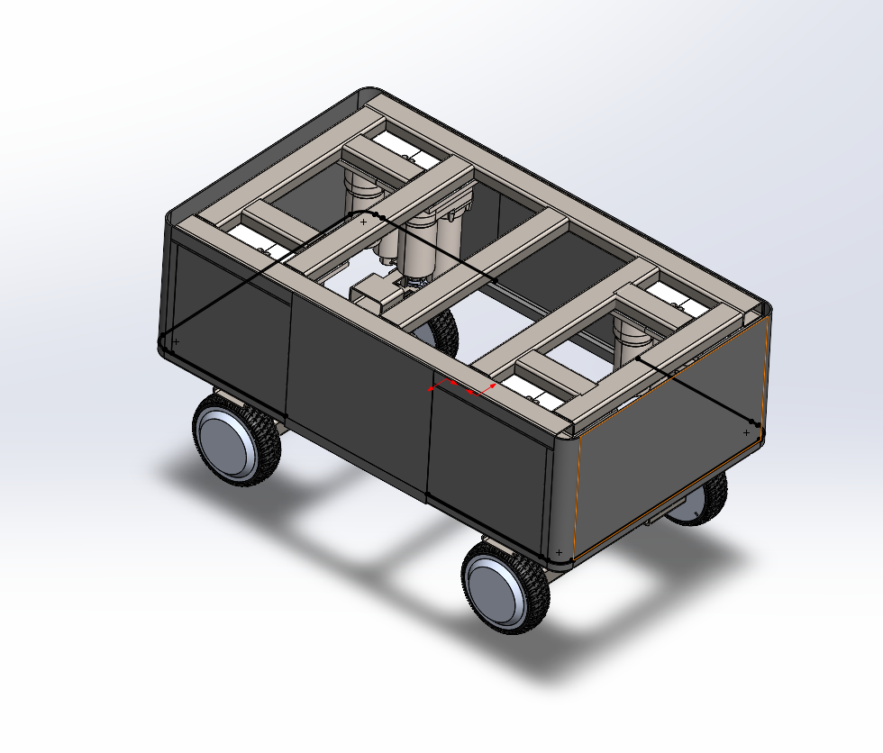
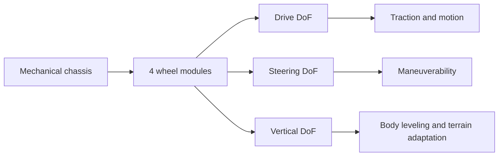
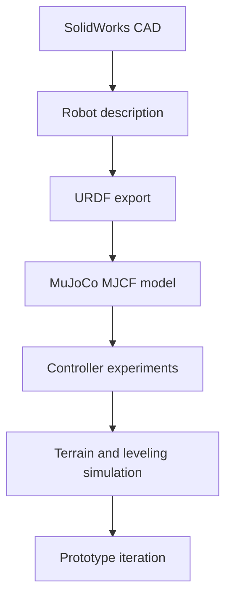

<div align="center">

# 4W3DOF Mobile Robotic Platform

<p>
  <strong>A terrain-adaptive robotic base with four independent 3-DoF wheel modules</strong>
</p>

<p>
  This repository is the main project hub for a modular mobile platform that combines drive, steering, and active vertical wheel positioning in a single chassis architecture.
</p>

<p>
  <a href="https://github.com/Dcatik/adaptive-wheel-base/tree/main">
    
  </a>
  <a href="https://github.com/Dcatik/adaptive-wheel-base">
    
  </a>
  <a href="LICENSE">
    
  </a>
  </a>
  <a href="https://mujoco.readthedocs.io/en/stable/overview.html">
    
  </a>
</p>

<p>
  
</p>

<p>
  <a href="#project-overview">Overview</a> |
  <a href="#platform-architecture">Architecture</a> |
  <a href="#development-branches">Branches</a> |
  <a href="#development-pipeline">Pipeline</a> |
  <a href="#roadmap">Roadmap</a>
</p>

</div>

---

## Project Overview

This project explores a middle ground between classical wheeled robots and fully legged systems.

Instead of relying on passive suspension alone, the platform uses **four independent wheel modules**, and each module provides:

1. wheel rotation for traction
2. steering for directional control
3. vertical positioning for terrain adaptation and body leveling

That gives the full robot **12 controlled wheel DoF**, which makes the platform both highly adaptable and significantly more interesting from a control and mechatronics standpoint than a conventional mobile base.

---

## Why This Platform Is Interesting

| Aspect | Conventional wheeled robot | This platform |
|:--|:--|:--|
| Mobility efficiency | High | High |
| Terrain adaptation | Limited | Actively adjustable |
| Steering freedom | Usually fixed or limited | Independent per wheel |
| Body attitude control | Mostly passive | Potentially active |
| Mechanical complexity | Lower | Higher, but still below legged systems |

<p align="center">
  <strong>4 wheel modules</strong> |
  <strong>3 DoF per module</strong> |
  <strong>12 controlled wheel DoF</strong> |
  <strong>terrain-adaptive chassis</strong>
</p>

---

## Platform Architecture



Each corner module is intended to behave like a compact mechatronic subsystem rather than a passive wheel assembly. That changes the robot from a standard chassis into a configurable locomotion platform.

---

## Development Branches

The `main` branch is the project landing page and concept hub. The implementation work is split into focused branches:

| Branch | Focus | Open |
|:--|:--|:--|
| `feature/urdf-to-mujoco-export` | URDF to MuJoCo conversion workflow, model export, MJCF preparation | [Open branch](https://github.com/Dcatik/adaptive-wheel-base/tree/feature/urdf-to-mujoco-export) |
| `feature/electromechanical-control` | MuJoCo simulation, low-level controllers, wheel motor model, telemetry | [Open branch](https://github.com/Dcatik/adaptive-wheel-base/tree/feature/electromechanical-control) |

<p align="center">
  <a href="https://github.com/Dcatik/adaptive-wheel-base/tree/feature/urdf-to-mujoco-export">
    
  </a>
  <a href="https://github.com/Dcatik/adaptive-wheel-base/tree/feature/electromechanical-control">
    
  </a>
</p>

These branches reflect two major engineering tracks in the repository:

- geometry and model conversion
- simulation, actuation, and controller behavior

---

## Engineering Goals

- design a rigid modular chassis with four independent adaptive wheel modules
- keep the mechanical concept manufacturable and prototype-friendly
- build a clean path from CAD to robot description and simulation
- validate drive, steering, and height-control ideas in simulation first
- prepare the platform for future ROS2, control, and hardware integration

---

## Degrees Of Freedom

| Subsystem | Count |
|:--|:--|
| Wheel drive DoF | 4 |
| Wheel steering DoF | 4 |
| Vertical wheel DoF | 4 |
| Total controlled wheel DoF | 12 |

### Architectural implications

Advantages:
- high terrain adaptability
- improved wheel-ground contact management
- body pose control potential
- redundancy for future optimization-based control

Challenges:
- mechanical packaging
- wiring and power routing
- actuator selection
- coordinated control across all modules
- mass, cost, and reliability tradeoffs

---

## Development Pipeline



Planned simulation and software path:

1. mechanical design in CAD
2. export to robot description formats
3. build simulation-ready URDF and MJCF representations
4. develop control architecture for wheel drive, steering, and vertical actuation
5. validate behavior before hardware implementation

---

## Intended Applications

- rough-terrain mobile robotics
- adaptive suspension research
- robotic delivery bases for imperfect surfaces
- locomotion and control experiments
- educational mechatronics and robotics projects
- modular payload carrier platforms

---

## Planned Repository Structure

```text
adaptive-wheel-base/
|-- cad/                # SolidWorks parts, assemblies, exports
|-- docs/               # Design notes, calculations, diagrams
|-- robot_description/  # URDF and related assets
|-- mujoco/             # MJCF models, renders, simulation media
|-- control/            # Controllers and actuator models
|-- sim/                # Simulation entry points and tooling
|-- electronics/        # Wiring, power, drivers, BOM
`-- README.md
```

---

## Visual GitHub Extras

<p align="center">
  <a href="https://github.com/Dcatik">
    
  </a>
  <a href="https://github.com/Dcatik?tab=repositories">
    
  </a>
</p>

<p align="center">
  <a href="https://github.com/Dcatik/adaptive-wheel-base">
    
  </a>
</p>

---

## Roadmap

### Phase 1. Mechanical concept

- [x] initial chassis layout
- [x] 4-wheel module architecture
- [x] body enclosure concept
- [ ] actuator selection
- [ ] bearing and transmission validation
- [ ] mass estimation

### Phase 2. Modeling

- [ ] define kinematic structure
- [ ] derive system constraints
- [ ] export CAD to simulation-ready model
- [ ] prepare simplified dynamic model

### Phase 3. Control

- [ ] wheel drive control
- [ ] steering control
- [ ] active height control
- [ ] body leveling controller
- [ ] terrain adaptation logic

### Phase 4. Prototype

- [ ] manufacturing-ready redesign
- [ ] electronics integration
- [ ] power system selection
- [ ] embedded control implementation
- [ ] field testing

---

## References

<p align="center">
  <a href="https://mujoco.readthedocs.io/en/stable/overview.html">
    
  </a>
  <a href="https://docs.github.com/en/get-started/writing-on-github/working-with-advanced-formatting/creating-diagrams">
    
  </a>
  <a href="https://www.ros.org/">
    
  </a>
</p>


---

## License

Distributed under the [MIT License](LICENSE).
